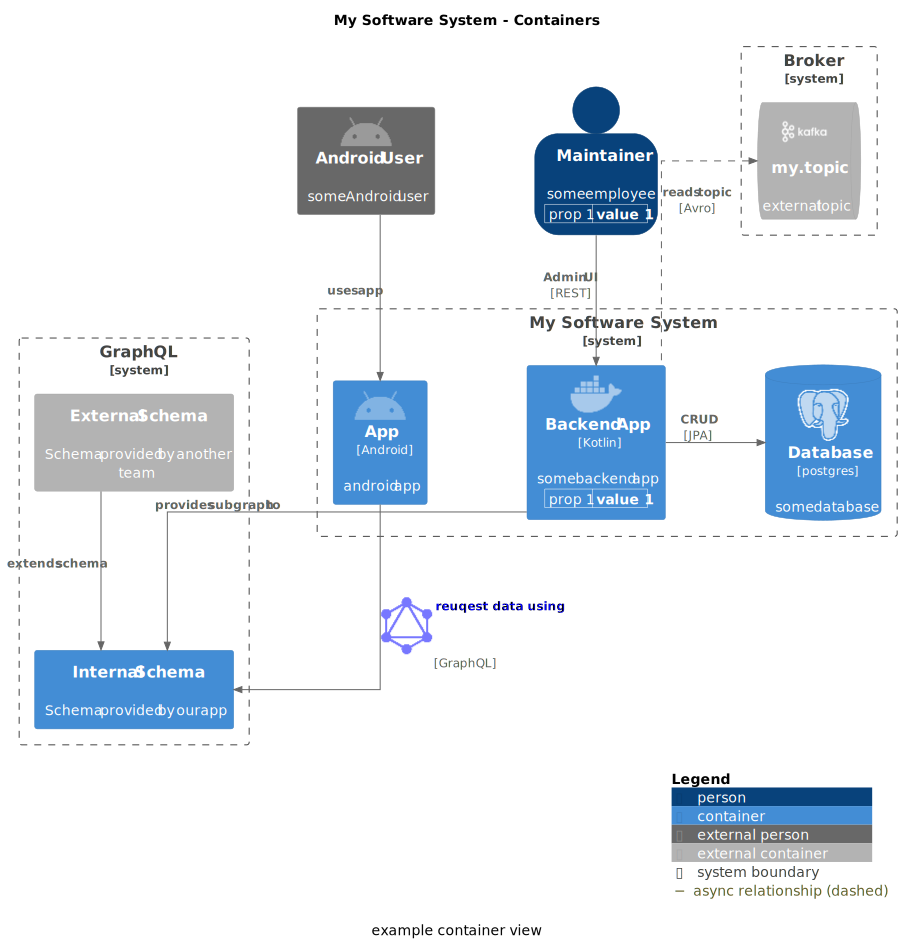

[](https://github.com/chriskn/structurizr-c4puml-extension/actions/workflows/pr-pipeline.yml)

# Structurizr C4-PlantUML extension

Structurizr C4-PlantUML extension aims to bridge the gap between the [structurizr java library](https://github.com/structurizr/java) and [C4-PlantUML](https://github.com/plantuml-stdlib/C4-PlantUML) by extending the structurizr model and providing an extended C4-PlantUML exporter. It is written in Kotlin.   

## Table of contents
  * [Examples](#example)
  * [How to use it](#how-to-use-it)
  * [Related resources](#related-resources)

## Examples

The following examples diagrams demonstrate the additional features the Structurizr C4-PlantUML extension provides: 

* links, icons and properties for elements and relationships
* external containers 
* visualization for system and container boundaries
* database and queue shapes
* differentiation between synchronous and asynchronous relationships
* nested numbered parallel sequences for dynamic diagrams
* advanced layout configuration for C4-PlantUML diagrams

More examples can be found under `src/test/kotlin`

### Core diagrams 



The following code creates and writes the example container diagram:

```kotlin
val workspace = Workspace("My Workspace", "")
val model = workspace.model
val properties = C4Properties(values = listOf(listOf("prop 1", "value 1")))
val softwareSystem = model.softwareSystem(
    name = "My Software System",
    description = "system description",
    link = "https://www.google.de"
)
val backendApplication = softwareSystem.container(
    name = "Backend App",
    description = "some backend app",
    technology = "Kotlin",
    tags = listOf("Tag2"),
    icon = "docker",
    link = "https://www.google.de",
    properties = properties
)
val app = softwareSystem.container(
    name = "App",
    description = "android app",
    technology = "Android",
    icon = "android",
)
val database = softwareSystem.container(
    name = "Database",
    description = "some database",
    c4Type = C4Type.DATABASE,
    technology = "postgres",
    icon = "postgresql",
    usedBy = listOf(Dependency(backendApplication, "CRUD", "JPA"))
)
val broker = model.softwareSystem(
    name = "Broker",
    description = "Message Broker",
    location = Location.External,
    c4Type = C4Type.QUEUE,
    icon = "kafka",
)
val topic = broker.container(
    "my.topic",
    "external topic",
    c4Type = C4Type.QUEUE,
    icon = "kafka",
    usedBy = listOf(
        Dependency(backendApplication, "reads topic", "Avro", interactionStyle = InteractionStyle.Asynchronous)
    )
)
val graphql = model.softwareSystem(
    name = "GraphQL",
    description = "Federated GraphQL",
    location = Location.External,
    icon = "graphql"
)
val internalSchema = graphql.container(
    name = "Internal Schema",
    description = "Schema provided by our app",
    location = Location.Internal,
    usedBy = listOf(
        Dependency(backendApplication, "provides subgraph to"),
        Dependency(app, "reuqest data using", "GraphQL", icon = "graphql", link = "https://graphql.org/")
    )
)
val externalSchema = graphql.container(
    name = "External Schema",
    description = "Schema provided by another team",
    uses = listOf(Dependency(internalSchema, "extends schema"))
)
val androidUser = model.person(
    name = "Android User",
    description = "some Android user",
    location = Location.External,
    icon = "android",
    uses = listOf(Dependency(app, "uses app"))
)
val maintainer = model.person(
    name = "Maintainer",
    description = "some employee",
    location = Location.Internal,
    link = "https://www.google.de",
    uses = listOf(
        Dependency(backendApplication, "Admin UI", "REST")
    ),
    properties = properties
)

fun createAndWriteContainerView(){
    val containerView = workspace.views.containerView(
        softwareSystem,
        "ContainerWithBoundary",
        "Example container view",
        C4PlantUmlLayout(
            legend = Legend.ShowLegend,
            layout = Layout.TopDown,
            lineType = LineType.Ortho,
            nodeSep = 100,
            rankSep = 130,
            dependencyConfigurations = listOf(
                DependencyConfiguration(filter = { it.destination == database }, direction = Direction.Right),
                DependencyConfiguration(filter = { it.destination == topic }, direction = Direction.Up)
            )
        )
    )
    containerView.addAllContainers()
    containerView.externalSoftwareSystemBoundariesVisible = true
    containerView.add(topic)
    containerView.add(internalSchema)
    containerView.add(externalSchema)
    containerView.addDependentSoftwareSystems()
    containerView.addAllPeople()

    workspace.writeDiagrams(File("diagrams/"))
}
```
### Dynamic diagrams

As the following example shows, the C4-PlantUML extension provides, in addition to the parallel sequences provided by the Structurizr library, nested numbered parallel sequences for dynamic diagrams. 


```kotlin
dynamicView.add(customer, customerFrontend, "Uses")
dynamicView.add(customerFrontend, customerService, "Updates customer information using")
dynamicView.add(customerService, customerDatabase, "Stores data in")
dynamicView.add(customerService, messageBus, "Sends customer update events to")
with(dynamicView.startNestedParallelSequence()) {
    add(messageBus, reportingService, "Sends customer update events to")
    with(this.startNestedParallelSequence()) {
        add(reportingService, reportingDatabase, "Stores data in")
        endParallelSequence()
    }
    add(messageBus, auditingService, "Sends customer update events to")
    with(this.startNestedParallelSequence()) {
        add(auditingService, auditStore, "Stores events in")
        endParallelSequence()
    }
    add(customerService, customerFrontend, "Confirms update to")
    endParallelSequence()
}
```

Dynamic diagrams can also be rendered as sequence diagram by setting the property `DynamicView.renderAsSequenceDiagram` to true.


## How to use it 

Structurizr C4-PlantUML extension is available in maven central. 

Example using gradle kotlin:

```kotlin
repositories {
    mavenCentral()
}

dependencies {
    implementation("io.github.chriskn:structurizr-c4puml-extension:$currentVersion")
} 
```

## Related resources

### Blog posts

* [Part 1: Workflow and tooling](https://blog.codecentric.de/en/2022/08/architecture-documentation-docs-as-code-structurizr-asciidoctor)
* [Part 2: Asciidoctor](https://blog.codecentric.de/architecture-documentation-as-code-with-structurizr-and-asciidoctor-part-2-asciidoctor)
* [Part 3: Structurizr](https://blog.codecentric.de/architecture-documentation-as-code-with-structurizr-and-asciidoctor-part-3-structurizr)
* [Part 4: Publishing](https://blog.codecentric.de/architecture-documentation-as-code-with-structurizr-and-asciidoctor-part4-publishing)
* [Part 5: Generating documentation](https://blog.codecentric.de/architecture-docs-as-code-structurizr-asciidoctor-part-5-generating-documentation)

### Example project

An example project using this library can be found [on GitHub](https://github.com/chriskn/arch-docs-as-code-example/).
