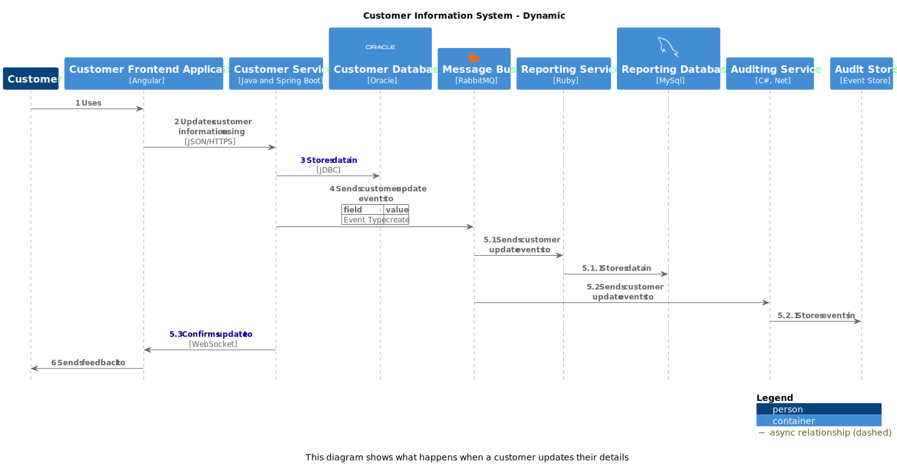
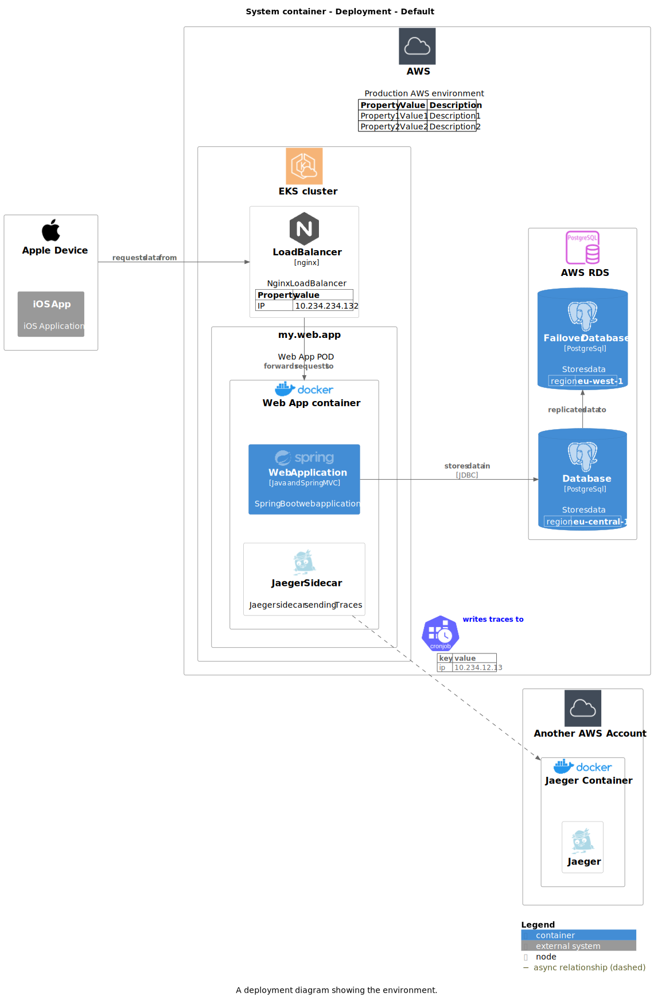

[](https://github.com/chriskn/structurizr-c4puml-extension/actions/workflows/pr-pipeline.yml)

# Structurizr C4-PlantUML extension

Structurizr C4-PlantUML extension aims to bridge the gap between the [structurizr java library](https://github.com/structurizr/java) and [C4-PlantUML](https://github.com/plantuml-stdlib/C4-PlantUML) by extending the structurizr model and providing an extended C4-PlantUML exporter. It is written in Kotlin.   

## Table of contents
  * [Examples](#example)
  * [How to use it](#how-to-use-it)
  * [Related resources](#related-resources)

## Examples

The following examples diagrams demonstrate the features the Structurizr C4-PlantUML provides: 

* links, icons and properties for elements and relationships
* external containers 
* visualization for system and container boundaries
* database and queue shapes
* differentiation between synchronous and asynchronous relationships
* nested numbered parallel sequences for dynamic diagrams
* advanced layout configuration for C4-PlantUML diagrams
* sprite api allowing to use the PlantUML StdLib and custom sprite definitions
* custom styles for model elements and relationships

More examples can be found under `src/test/kotlin`

### Core diagrams


The following code creates and writes the example container diagram:

```kotlin
val workspace = Workspace("My Workspace", "")
val model = workspace.model
val properties = C4Properties(values = listOf(listOf("prop 1", "value 1")))
val softwareSystem = model.softwareSystem(
    name = "My Software System",
    description = "system description",
    link = "https://www.google.de"
)
val backendApplication = softwareSystem.container(
    name = "Backend App",
    description = "some backend app",
    technology = "Kotlin",
    tags = listOf("Tag2"),
    sprite = SpriteLibrary.spriteByName("logos-docker-icon"),
    link = "https://www.google.de",
    properties = properties
)
val app = softwareSystem.container(
    name = "App",
    description = "android app",
    technology = "Android",
    sprite = SpriteLibrary.spriteByName("logos-android-icon"),
)
val database = softwareSystem.container(
    name = "Database",
    description = "some database",
    c4Type = C4Type.DATABASE,
    technology = "postgres",
    sprite = SpriteLibrary.spriteByName("logos-postgresql"),
    usedBy = listOf(
        Dependency(
            destination = backendApplication,
            description = "CRUD",
            technology = "JPA"
        )
    )
)
val broker = model.softwareSystem(
    name = "Broker",
    description = "Message Broker",
    location = Location.External,
    c4Type = C4Type.QUEUE,
    sprite = SpriteLibrary.spriteByName("tupadr3-devicons2-apachekafka-original-wordmark"),
)
val topic = broker.container(
    "my.topic",
    "external topic",
    c4Type = C4Type.QUEUE,
    sprite = SpriteLibrary.spriteByName("tupadr3-devicons2-apachekafka-original-wordmark"),
    usedBy = listOf(
        Dependency(
            destination = backendApplication,
            description = "reads topic",
            technology = "Avro",
            interactionStyle = InteractionStyle.Asynchronous
        )
    )
)
val graphql = model.softwareSystem(
    name = "GraphQL",
    description = "Federated GraphQL",
    location = Location.External,
    sprite = SpriteLibrary.spriteByName("logos-graphql")
)
val internalSchema = graphql.container(
    name = "Internal Schema",
    description = "Schema provided by our app",
    location = Location.Internal,
    usedBy = listOf(
        Dependency(
            destination = backendApplication,
            description = "provides subgraph to"
        ),
        Dependency(
            destination = app,
            description = "reuqest data using",
            technology = "GraphQL",
            sprite = SpriteLibrary.spriteByName("logos-graphql"),
            link = "https://graphql.org/"
        )
    )
)
val externalSchema = graphql.container(
    name = "External Schema",
    description = "Schema provided by another team",
    uses = listOf(Dependency(destination = internalSchema, description = "extends schema"))
)
model.person(
    name = "Android User",
    description = "some Android user",
    location = Location.External,
    sprite = SpriteLibrary.spriteByName("logos-android-icon"),
    uses = listOf(Dependency(destination = app, description = "uses app"))
)
model.person(
    name = "Maintainer",
    description = "some employee",
    location = Location.Internal,
    link = "https://www.google.de",
    uses = listOf(
        Dependency(
            destination = backendApplication,
            description = "Admin UI",
            technology = "REST"
        )
    ),
    properties = properties
)

val diagramKey = "ContainerWithBoundary"
val containerView = workspace.views.containerView(
    system = softwareSystem,
    key = diagramKey,
    description = "example container view",
    layout = C4PlantUmlLayout(
        legend = Legend.ShowLegend,
        layout = Layout.TopDown,
        lineType = LineType.Ortho,
        nodeSep = 100,
        rankSep = 130,
        dependencyConfigurations = listOf(
            DependencyConfiguration(
                filter = { it.destination == database },
                direction = Right
            ),
            DependencyConfiguration(
                filter = { it.destination == topic },
                direction = Up
            )
        )
    )
)
containerView.addAllContainers()
containerView.showExternalSoftwareSystemBoundaries = true
containerView.add(topic)
containerView.add(internalSchema)
containerView.add(externalSchema)
containerView.addDependentSoftwareSystems()
containerView.addAllPeople()

    workspace.writeDiagrams(File("diagrams/"))
}
```
### Dynamic diagrams

As the following example shows, the C4-PlantUML extension provides, in addition to the parallel sequences provided by the Structurizr library, nested numbered parallel sequences for dynamic diagrams. 


```kotlin
val dynamicView: DynamicView = workspace.views.dynamicView(
    system = customerInformationSystem,
    key = diagramKey,
    description = "This diagram shows what happens when a customer updates their details",
    layout = C4PlantUmlLayout(
        dependencyConfigurations = listOf(
            DependencyConfiguration(
                filter = { it.source == customerFrontend || it.destination == messageBus },
                direction = Right
            ),
            DependencyConfiguration(
                filter = { it.source == customerService && it.destination == customerFrontend },
                direction = Left
            ),
            DependencyConfiguration(
                filter = { it.source == customer },
                direction = Right
            ),
            DependencyConfiguration(
                filter = { it.destination == customer },
                direction = Left
            )
        )
    )
)

dynamicView.add(source = customer, destination = customerFrontend, description = "Uses")
dynamicView.add(source = customerFrontend, destination = customerService, description = "Updates customer information using")
dynamicView.add(source = customerService, destination = customerDatabase, description = "Stores data in")
dynamicView.add(source = customerService, destination = messageBus, description = "Sends customer update events to")
with(dynamicView.startNestedParallelSequence()) {
    add(source = messageBus, destination = reportingService, description = "Sends customer update events to")
    with(this.startNestedParallelSequence()) {
        add(source = reportingService, destination = reportingDatabase, description = "Stores data in")
        endParallelSequence()
    }
    add(source = messageBus, destination = auditingService, description = "Sends customer update events to")
    with(this.startNestedParallelSequence()) {
        add(source = auditingService, destination = auditStore, description = "Stores events in")
        endParallelSequence()
    }
    add(source = customerService, destination = customerFrontend, description = "Confirms update to")
    endParallelSequence()
}
dynamicView.add(source = customerFrontend, destination = customer, description = "Sends feedback to")

assertExpectedDiagramWasWrittenForView(workspace, pathToExpectedDiagrams, diagramKey)
```

Dynamic diagrams can also be rendered as sequence diagram by setting the property `DynamicView.renderAsSequenceDiagram` to true.



### Deployment diagrams

As the following example demonstrates how to model deployments and create deployment diagrams using the C4-PlantUML extension.



```kotlin
  val mySystem = model.softwareSystem(
    "System container",
    "Example System",
    Location.Internal
)
val iosApp = model.softwareSystem(
    location = Location.External,
    name = "iOS App",
    description = "iOS Application"
)
val webApplication: Container = mySystem.container(
    "Web Application",
    "Spring Boot web application",
    technology = "Java and Spring MVC",
    sprite = SpriteLibrary.spriteByName("logos-spring"),
)
val database: Container = mySystem.container(
    "Database",
    "Stores data",
    technology = "PostgreSql",
    sprite = SpriteLibrary.spriteByName("logos-postgresql"),
    c4Type = C4Type.DATABASE,
    properties = C4Properties(values = listOf(listOf("region", "eu-central-1"))),
    usedBy = listOf(Dependency(webApplication, "stores data in", "JDBC"))
)
val failoverDatabase: Container = mySystem.container(
    name = "Failover Database",
    description = database.description,
    technology = database.technology,
    sprite = database.sprite,
    c4Type = database.c4Type,
    properties = C4Properties(values = listOf(listOf("region", "eu-west-1"))),
    usedBy = listOf(Dependency(database, "replicates data to"))
)
val aws = model.deploymentNode(
    "AWS",
    "Production AWS environment",
    sprite = SpriteLibrary.spriteByName("aws-Groups-AWSCloudAlt"),
    properties = C4Properties(
        header = listOf("Property", "Value", "Description"),
        values = listOf(
            listOf("Property1", "Value1", "Description1"),
            listOf("Property2", "Value2", "Description2"),
        )
    )
)
aws.deploymentNode(
    "AWS RDS",
    sprite = SpriteLibrary.spriteByName("aws-database-AuroraPostgreSQLInstance"),
    hostsContainers = listOf(failoverDatabase, database)
)
val eks = aws.deploymentNode(
    "EKS cluster",
    sprite = SpriteLibrary.spriteByName("aws-containers-EKSCloud"),
)

val webAppPod = eks.deploymentNode(
    "my.web.app",
    "Web App POD"
).deploymentNode(
    "Web App container",
    sprite = SpriteLibrary.spriteByName("logos-docker-img"),
    hostsContainers = listOf(webApplication)
)
val jaegerSprite = (
        SpriteLibrary.spriteByName("tupadr3-devicons2-jaegertracing") as PlantUmlSprite
        ).copy(color = "lightblue")
val jaegerSidecar = webAppPod.infrastructureNode(
    "Jaeger Sidecar",
    "Jaeger sidecar sending Traces",
    sprite = jaegerSprite
)
val aws2 = model.deploymentNode(
    "Another AWS Account",
    sprite = SpriteLibrary.spriteByName("aws-groups-AWSCloudAlt")
)
val jaegerContainer = aws2.deploymentNode(
    name = "Jaeger Container",
    sprite = SpriteLibrary.spriteByName("logos-docker-img"),
    usedBy = listOf(
        Dependency(
            jaegerSidecar,
            "writes traces to",
            interactionStyle = Asynchronous,
            link = "https://www.jaegertracing.io/",
            sprite = SpriteLibrary.spriteByName("k8s-KubernetesCronjob"),
            properties = C4Properties(
                header = listOf("key", "value"),
                values = listOf(listOf("ip", "10.234.12.13"))
            )
        )
    )
)
jaegerContainer.infrastructureNode("Jaeger", sprite = jaegerSprite)
val appleDevice = model.deploymentNode(
    "Apple Device",
    sprite = SpriteLibrary.spriteByName("tupadr3-devicons-apple"),
    hostsSystems = listOf(iosApp)
)

val loadBalancer = eks.infrastructureNode(
    name = "Load Balancer",
    description = "Nginx Load Balancer",
    technology = "nginx",
    sprite = SpriteLibrary.spriteByName("logos-nginx"),
    link = "https://www.google.de",
    uses = listOf(Dependency(webAppPod, "forwards requests to")),
    usedBy = listOf(Dependency(appleDevice, "requests data from")),
    properties = C4Properties(
        header = listOf("Property", "value"),
        values = listOf(listOf("IP", "10.234.234.132"))
    )
)

val deploymentView =
    views.deploymentView(
        mySystem,
        diagramKey,
        "A deployment diagram showing the environment.",
        C4PlantUmlLayout(
            nodeSep = 50,
            rankSep = 50,
            layout = LeftToRight,
            dependencyConfigurations =
            listOf(
                DependencyConfiguration(
                    filter = {
                        it.source == loadBalancer || it.destination.name == failoverDatabase.name
                    },
                    direction = Right
                )
            )
        )
    )
deploymentView.addDefaultElements()
```

## How to use it 

Structurizr C4-PlantUML extension is available in maven central. 

Example using gradle kotlin:

```kotlin
repositories {
    mavenCentral()
}

dependencies {
    implementation("io.github.chriskn:structurizr-c4puml-extension:$currentVersion")
} 
```

## Related resources

### Blog posts

* [Part 1: Workflow and tooling](https://blog.codecentric.de/en/2022/08/architecture-documentation-docs-as-code-structurizr-asciidoctor)
* [Part 2: Asciidoctor](https://blog.codecentric.de/architecture-documentation-as-code-with-structurizr-and-asciidoctor-part-2-asciidoctor)
* [Part 3: Structurizr](https://blog.codecentric.de/architecture-documentation-as-code-with-structurizr-and-asciidoctor-part-3-structurizr)
* [Part 4: Publishing](https://blog.codecentric.de/architecture-documentation-as-code-with-structurizr-and-asciidoctor-part4-publishing)
* [Part 5: Generating documentation](https://blog.codecentric.de/architecture-docs-as-code-structurizr-asciidoctor-part-5-generating-documentation)

### Example project

An example project using this library can be found [on GitHub](https://github.com/chriskn/arch-docs-as-code-example/).
